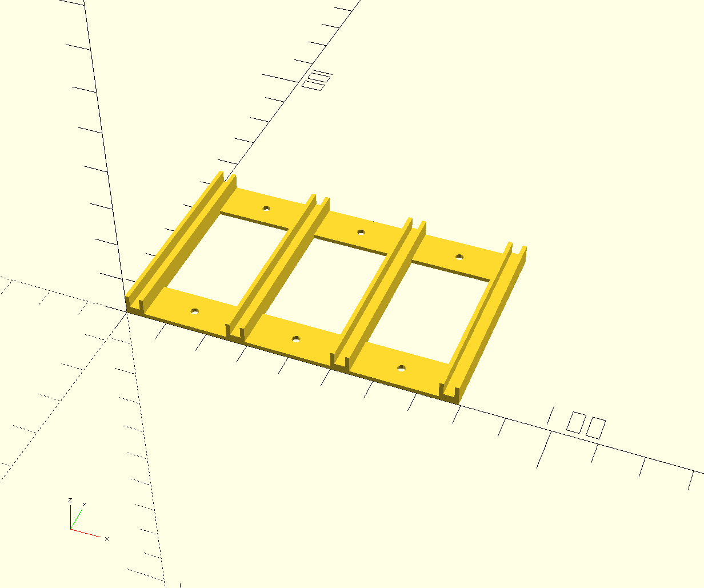

# Raspberry Pi stack holder

## Parameters
    holder(
        depth=50,               // Depth of the holder
        wall_thickness=1,       // Thickness of all walls
        slots=4,                // Amount of slots (16 fits width of a standard rack)
        slot_width=2.5,         // Width of the slots
        slot_depth=3,           // Depth of the slots
        slot_depth_padding=1,   // Extra padding for the slot depth, in addition to the wall thickness
        slot_spacing=25         // Spacing between each slot
    );

## Requirements
* [OpenSCAD](https://openscad.org/downloads.html)

## Example

Holder generated using default parameters
